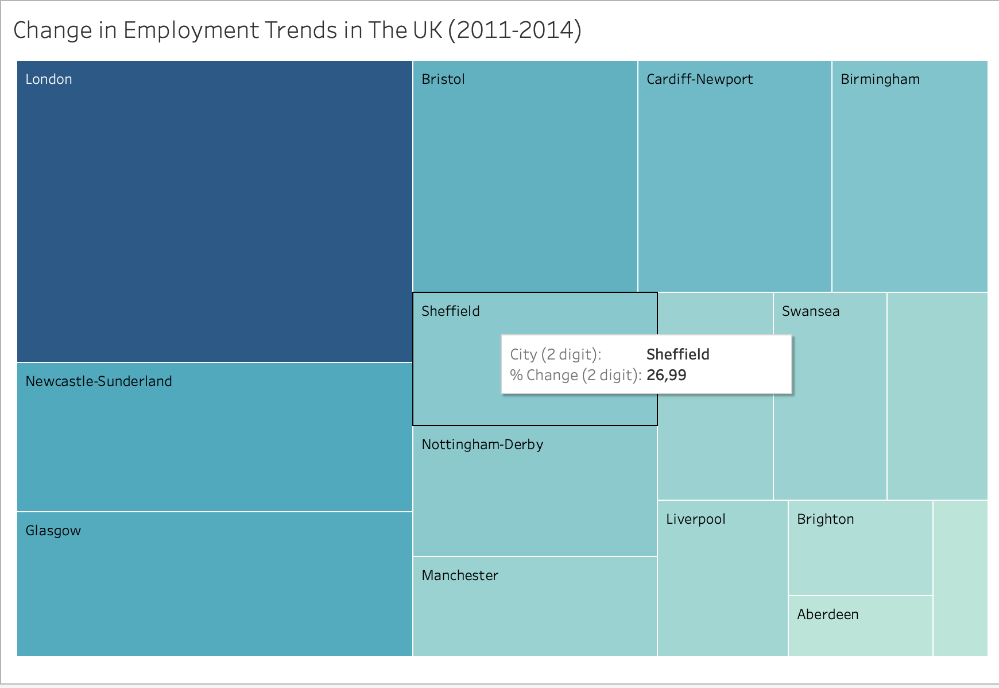
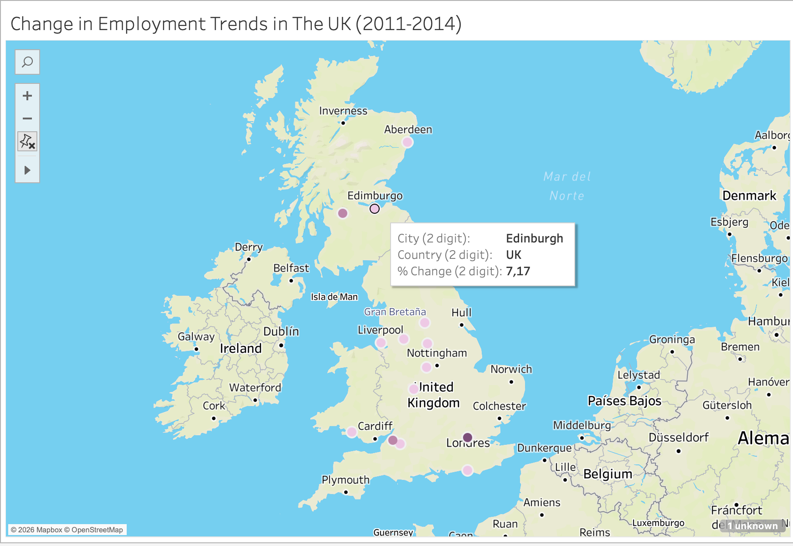
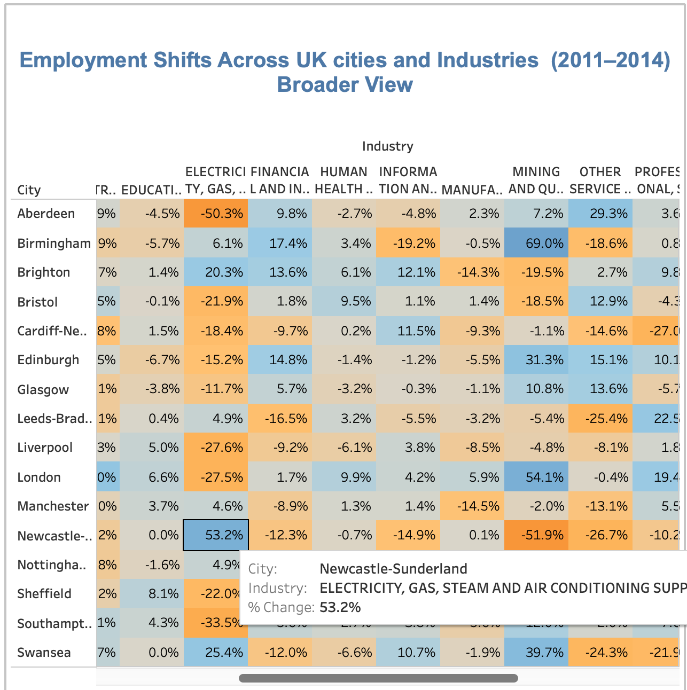

### 📈  Shifts in UK Employment Market (2011-2014) 

This repository contains data visualisation projects developed in Tableau to analyse regional economic shifts in the United Kingdom. The data set is named as UK Industrial Employment Trends (EMSI) and was provided by JustIT.

### Situation

Economic fluctuations between 2011 and 2014 significantly impacted UK regions, requiring a clear way to distinguish between broad economic trends and specific industrial shifts.

### Task

Create a comprehensive visualisation suite in Tableau that allows stakeholders to navigate between high-level regional overviews and granular sector-specific analysis.

### Action

- **Data Architecture:** I utilised a dual-layer dataset structure consisting of 1-digit (Broad Industries) and 2-digit (Detailed Sub-industries) sheets to allow for hierarchical exploration.
- **Visual Strategy:** I developed two distinct dashboards using geographic maps for spatial distribution (highlighting the cities where changes were sharper), bar charts for ranking, and heat maps to visualise the intensity of sector shifts per specific cities.
- **Analytical Validation:** I performed a cross-sheet validation using Swansea as a control. By tracing a +42.7% growth in the broad Arts & Entertainment sector down to specific sub-sectors, I ensured the accuracy of my calculated fields and data joins across the entire workbook.

### Result & Key Findings

The final product is a multi-dashboard setup that identifies a "two-speed" economy across the UK:

- **Regional Growth Divergence:** The analysis highlighted significant localised booms, such as Aberdeen’s Administrative and Support sector, which grew by +32.2% (adding over 7,200 jobs).
- **Granular Insights:** The "drill-down" functionality revealed that growth in one area often masked declines in others. For instance, in Swansea, the high growth in leisure was contrasted by a sharp -21.9% decline in Professional and Scientific services.
- **Public Sector Contraction:** Traditional sectors faced widespread challenges, notably in Birmingham, where Public Administration and Defence saw a -5.3% decrease, representing a loss of 2,680 jobs.
  
### Live Dashboards:
[Dashboard 1](https://public.tableau.com/views/Change_17711741128970/Dashboard12?:language=en-US&publish=yes&:sid=&:redirect=auth&:display_count=n&:origin=viz_share_link)
[Dashboard 2](https://public.tableau.com/views/Change_17711741128970/Dashboard4?:language=en-US&publish=yes&:sid=&:redirect=auth&:display_count=n&:origin=viz_share_link)

### 💡 Insights

## Beyond the Average: Learning from the Extremes

To understand the UK economy, we often look at the "average" trend, but the data suggests that the most extreme data points—the outliers—provide the most critical lessons. In this project, I treated outliers as essential signals rather than anomalies.

### 1. Outliers as "Success Blueprints"

Outliers highlight regions that have unlocked unique growth engines. For example, while professional services grew moderately in most UK hubs, **Nottingham-Derby** saw a massive **+47.9%** surge in Professional, Scientific and Technical Activities. By studying the driving forces behind this specific success, other cities can learn how to replicate that momentum.

### 2. Outliers as "Early Warning Signs"

Sharp declines serve as localised shocks that warrant investigation. My analysis revealed:

- **Cardiff-Newport** experienced a significant **-27.0%** drop in Professional, Scientific and Technical Activities.
- **Newcastle-Sunderland** saw a **-26.7%** decline in Other Service Activities.

Understanding the forces behind these specific extremes, such as regional budget shifts or industrial relocations, is crucial for organisations looking to prevent these trends from spreading.

### 3. Distinguishing Speed vs. Magnitude

A key finding from the dashboard is that a high percentage change does not always equal a high volume of jobs.

- **Swansea’s** Real Estate sector showed steady growth of **+11.5%**, which represents a gain of **277 jobs**.
- In contrast, **London’s** growth in the Professional sector (at a lower percentage) added **over 100,000 jobs**, demonstrating the massive scale of the capital.
- The most extreme growth in the dataset was found in **Newcastle-Sunderland**, where Electricity, Gas, and Steam grew by **+53.2%**.

### 4. The Swansea Validation

Through my validation process, I confirmed that Swansea's Public Administration showed stable growth of **+0.9%**. However, the city's real story was in Arts, Entertainment, and Recreation, which saw a boom of **+42.7%**, signalling a shift toward a leisure-driven regional economy.

### The National Picture: Redistribution, Not Just Loss

And finally, the data suggests that during this period, jobs were not necessarily "lost" to the economy—they were redistributed. While Public Administration **(-49,500 jobs)** and Manufacturing **(-28,000 jobs)** faced contraction nationwide, these losses were more than offset by massive surges in Professional Services **(+134,600 jobs)** and Administrative Support **(+120,000 jobs)** .

### Conclusion

The analysis proves that the UK economy is "tilting" rather than shrinking. By identifying these extremes, we can better understand where the economy is moving and prepare for a future where traditional sectors are being replaced by high-growth service and technical industries.

### 📊 Interact with the reports

[Download the WorkBook file from here](Change.twb)

The following are just screenshots of some reports. For a better experience, kindly visit the links to see them live ⬆️ 
  

