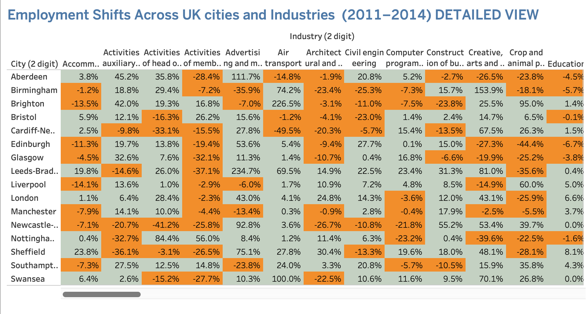

### 📈  Shifts in UK Employment Markets (2011/2014) 

This repository contains data visualisation projects developed in Tableau to analyse regional economic shifts in the United Kingdom. The data set is named as UK Industrial Employment Trends (EMSI) and was provided by JustIT.

**Situation:**  
Economic fluctuations between 2011 and 2014 significantly impacted UK regions, requiring a clear way to distinguish between broad trends and specific industrial shifts.

**Task:**  
Create a comprehensive visualisation suite that allows for both high-level regional overviews and granular sector analysis.

**Action:**  
- **Data Architecture:** I utilised a dataset with a dual-layer structure: 1-digit (Broad Industries) and 2-digit (Detailed Sub-industries).  
- **Visual Strategy:** I developed two distinct dashboards and multiple chart types (including geographic maps, bar charts, and heatmaps) to represent different facets of the data.  
- **Validation:** I used Swansea as a primary validation point to test the accuracy of my calculated fields across both sheets. I confirmed that the broad growth in Arts & Entertainment (+42.7%) was correctly reflected when drilling down into specific sub-sectors.

**Result:**  
The final product consists of a multi-dashboard setup where Dashboard 1 provides a macro view of the UK labour market, while subsequent views allow users to "drill down" into the 2-digit data for specific city-level insights.

**Live Dashboards:** [Dashboard 1](https://public.tableau.com/views/Change_17711741128970/Dashboard12?:language=en-US&publish=yes&:sid=&:redirect=auth&:display_count=n&:origin=viz_share_link)
[Dashboard 2](https://public.tableau.com/views/Change_17711741128970/Dashboard3?:language=en-US&publish=yes&:sid=&:redirect=auth&:display_count=n&:origin=viz_share_link)

### 💡 Insights

To understand the UK economy, we often look at the "average" trend, but the sources suggest that the most extreme data points—the outliers—provide the most critical lessons. To be clear, we are not suggesting that national trends are "hiding" inside these anomalies. Instead, we pay attention to outliers because they serve as essential signals for organizations to either encourage or prevent specific economic shifts.

First, outliers act as "Success Blueprints." For example, while professional services grew in many places, Nottingham-Derby saw a massive 47.9% surge. By studying the driving forces behind this specific success, other cities can learn how to replicate that growth.

Second, outliers are "Early Warning Signs." The sharp -27.0% drop in Public Administration in Cardiff-Newport and -26.7% in Swansea are localized shocks. If an organisation wants to prevent such declines from spreading, it must understand the forces—such as budget shifts or relocation—behind these specific extremes.

Finally, outliers help us distinguish between speed and magnitude. The public should understand that an outlier in percentage can be different from an outlier in actual jobs.Swansea’s 53.2% growth in Real Estate is a high-speed outlier but represents only 1,241 jobs. In contrast, London’s 19.4% growth in the Professional sector added over 100,000 jobs, showing massive scale. 

By watching how these extremes evolve, the public can better understand where the economy is "tilting" and prepare for the future. 

The following are just screenshots, kindly refer to the live dashboards for further visualisations.

## 📊  Interact with the reports
*   🔗 **[Interact with the reports about discounts here](https://sites.google.com/view/nadia-online/projects/deep-analysis)**
*   **[Download the WorkBook file from here](Change.twb)**
*   

